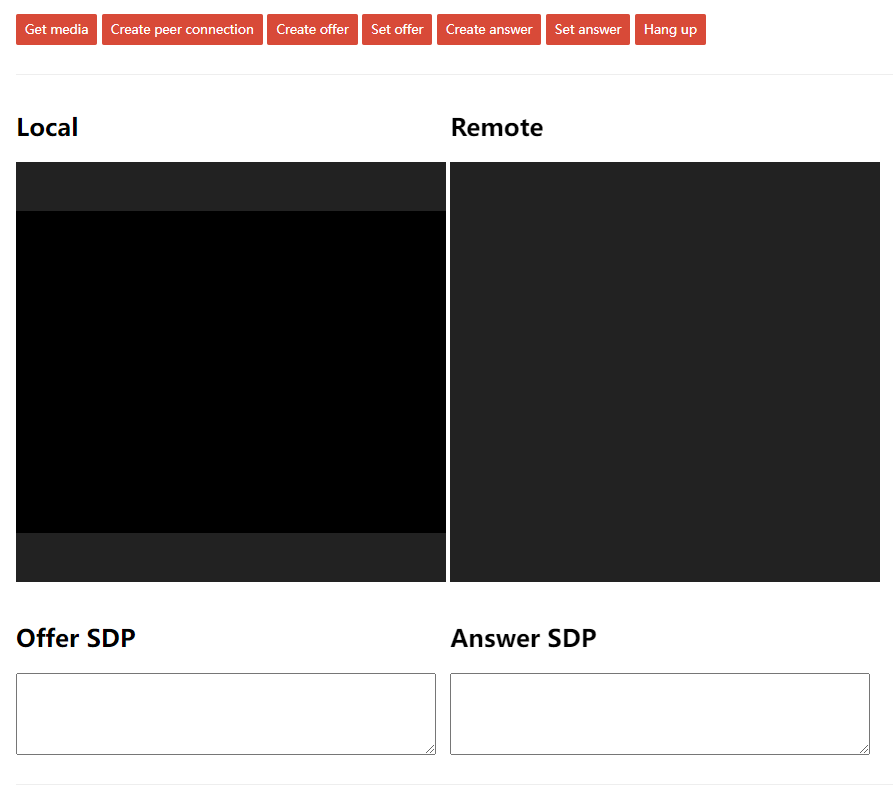

## test socket.io
```shell
# 根目录
yarn add express socket.io
node client2client\server.js
python -m http.server --bind 0.0.0.0 4040
```



### ClientA

```shell
Get media -> Create peer connection -> Create offer -> Set offer -> ... -> Hang up
```

### ClientB

```shell
Get media -> Create peer connection -> ... -> Create answer -> Set answer -> Hang up
```

